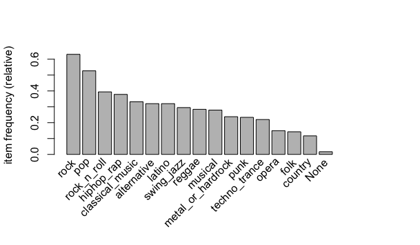
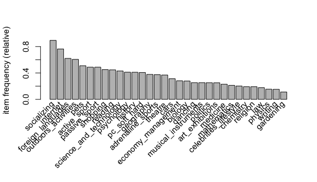

# Apriori Algorithm
Apriori algorithm is a classical algorithm in data mining. It is used for mining frequent itemsets and relevant association rules. It is devised to operate on a database containing a lot of transactions, for instance, items brought by customers in a store or the next example.
## Context
* In 2013, students of the Statistics class at FSEV UK were asked to participate in a survey.
* The survey was presented to participants in both electronic and written form.
* All participants were of Slovakian nationality, aged between 15-30.
* The variables can be split into the following groups:
	* Music preferences (19 items)
	* Hobbies & interests (32 items)

## Questionnaire

### Music Preferences 
* 19 items, 1010 instances
* Scale: Don't enjoy at all 1-2-3-4-5 Enjoy very much (integer) 
* Categories:
	* Folk
	* Country
	* Classical
	* Musicals
	* Pop
	* Rock
	* etc...

### Hobbies & Interests 
* 32 items, 1010 instances
* Scale: Don't enjoy at all 1-2-3-4-5 Enjoy very much (integer) 
* Categories:
	* History
	* Psychology
	* Politics
	* Medicine
	* Internet
	* Art
	* etc...

## Coding

### Library
* [arules](https://cran.r-project.org/web/packages/arules/index.html)

### Item Frequency





## Results

```R
> inspect(musicrules[1:20])
     lhs                                                rhs           support confidence lift  count
[1]  {alternative,metal_or_hardrock,punk}            => {rock}        0.064   0.956      1.516 65   
[2]  {metal_or_hardrock,punk,rock_n_roll}            => {rock}        0.071   0.960      1.522 72   
[3]  {alternative,metal_or_hardrock,rock_n_roll}     => {rock}        0.077   0.951      1.508 78   
[4]  {metal_or_hardrock,rock_n_roll,swing_jazz}      => {rock}        0.071   0.973      1.543 72   
[5]  {metal_or_hardrock,rock,swing_jazz}             => {rock_n_roll} 0.071   0.878      2.228 72   
[6]  {classical_music,metal_or_hardrock,rock_n_roll} => {rock}        0.068   0.958      1.519 69   
[7]  {alternative,punk,reggae}                       => {rock}        0.060   0.910      1.444 61   
[8]  {punk,reggae,rock_n_roll}                       => {rock}        0.072   0.936      1.484 73   
[9]  {alternative,punk,rock_n_roll}                  => {rock}        0.085   0.956      1.515 86   
[10] {punk,rock_n_roll,swing_jazz}                   => {rock}        0.063   0.955      1.515 64   
[11] {punk,rock,swing_jazz}                          => {rock_n_roll} 0.063   0.842      2.137 64   
[12] {musical,rock_n_roll,swing_jazz}                => {rock}        0.070   0.835      1.324 71   
[13] {musical,rock,swing_jazz}                       => {rock_n_roll} 0.070   0.807      2.047 71   
[14] {classical_music,musical,rock_n_roll}           => {rock}        0.071   0.837      1.327 72   
[15] {latino,reggae,rock_n_roll}                     => {rock}        0.062   0.863      1.368 63   
[16] {alternative,reggae,rock_n_roll}                => {rock}        0.070   0.888      1.407 71   
[17] {reggae,rock_n_roll,swing_jazz}                 => {rock}        0.079   0.870      1.379 80   
[18] {reggae,rock,swing_jazz}                        => {rock_n_roll} 0.079   0.816      2.072 80   
[19] {classical_music,reggae,rock_n_roll}            => {rock}        0.061   0.886      1.404 62   
[20] {pop,reggae,rock_n_roll}                        => {rock}        0.072   0.859      1.362 73   
```

```R
>inspect(hobbiesrules[1:15])
     lhs                                          rhs                      support confidence lift  count
[1]  {pc_soft_hard,physics}                    => {internet}               0.100   0.910      1.192 101  
[2]  {physics,science_and_technology}          => {internet}               0.109   0.887      1.162 110  
[3]  {internet,physics}                        => {science_and_technology} 0.109   0.803      1.864 110  
[4]  {physics,science_and_technology}          => {socializing}            0.112   0.911      1.019 113  
[5]  {physics,socializing}                     => {science_and_technology} 0.112   0.807      1.874 113  
[6]  {internet,physics}                        => {socializing}            0.124   0.912      1.021 125  
[7]  {physics,socializing}                     => {internet}               0.124   0.893      1.170 125  
[8]  {foreign_languages,law}                   => {socializing}            0.121   0.924      1.034 122  
[9]  {internet,law}                            => {socializing}            0.133   0.964      1.078 134  
[10] {law,socializing}                         => {internet}               0.133   0.802      1.051 134  
[11] {celebrities_lifestyle,pets}              => {shopping}               0.101   0.850      1.883 102  
[12] {celebrities_lifestyle,foreign_languages} => {shopping}               0.119   0.839      1.859 120  
[13] {celebrities_lifestyle,shopping}          => {internet}               0.146   0.891      1.167 147  
[14] {celebrities_lifestyle,internet}          => {shopping}               0.146   0.840      1.861 147  
[15] {celebrities_lifestyle,shopping}          => {socializing}            0.152   0.933      1.044 154
```
## Reference
* https://www.kaggle.com/miroslavsabo/young-people-survey/home

## License
[The MIT License](http://opensource.org/licenses/MIT)
